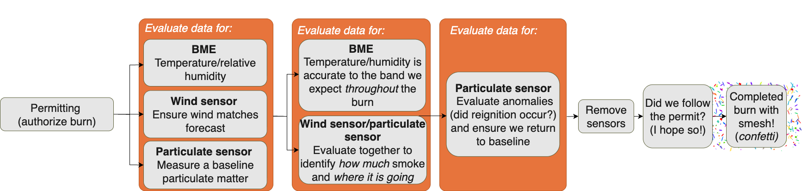
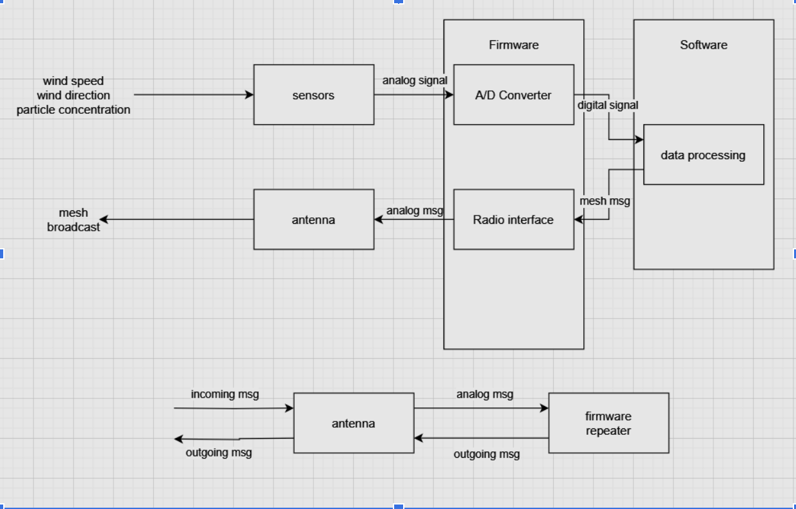

# SMesh Design Document

## Problem
Environmental sensors are currently insufficient for monitoring controlled burns. They are too expensive, too difficult to deploy, too permanent, or do not track all the critical variables. Thus, this document explains the reasons for development, the system from a higher level, and the project goals. This is a living document.

## (Internal) Stakeholders
An opportunity for Stanford students to apply their class material and interests across all schools at Stanford in an interdisciplinary project with real-world impact on fire management.

## (External) Stakeholders

| Stakeholder         | 👤 Description                                                                 | 🎯 Goals                                                                                  | 📌 Needs (from SMesh)                                                                                  |
|---------------------|--------------------------------------------------------------------------------|-------------------------------------------------------------------------------------------|--------------------------------------------------------------------------------------------------------|
| Fire practitioners  | 🧑‍🚒 Those doing the burn who actually manage it and make the smoke plan.      | Prevent hazards and maximize burn.                                                       | Understand if the burn is as predicted, and determine if they can conduct the burn.                   |
| Local community     | 🧑‍🍼 People in the surrounding area of a burn.                                 | Ensure safety regarding smoke; avoid poor air quality; stay informed about local burns.  | Timely notifications and easy-to-understand information about the local burns.                        |
| Land owners         | 🧑‍🌾 Those who own the land (e.g., state parks, private or institutional land). | Mitigate fire risk; prevent fire from spreading from/to neighboring property.            | Know the amount of fuel reduced (e.g., vegetation), and whether fire spread was effectively reduced.  |
| Government agencies | 🏛️ State and federal agencies (e.g., ARB, EPA) that grant permissions.         | Inform public policy, laws, and oversee prescribed burn operations and measurements.     | Burn statistics that help inform policies and guide practitioners toward beneficial community outcomes. |

## Evaluation of Alternatives and Key Benefits
Smoke sensor companies include PurpleAir, Air Gradient, and others. Most systems are based on early smoke detection or informing homeowners about smoke in their area. 

So, other smoke sensors lack these features:
- 🧺 Portable (can be carried by a person, e.g., fire personnel)
- ⏳Temporary (set up before an operation and removed after - in contrast to a pole in concrete or mounted to a building)
- ⛰️ Deployable in the wilderness (rugged terrain or with nearby vegetation)
- 🏗️ Efficient deployment (quick to set up and tear down)
- 🔋Independent in power (no wall outlet needed)
- 📻Operates without an external network (uses LoRa)
- 🕸️Connects sensors across the mesh (an interconnected network to fuse statistics on a burn area, rather than individually tracking smoke in many areas)
- 💸Cost-efficient (most smoke sensors are > $200 and require subscriptions)
- ⌚Real-time readout (smoke data that can be easily reviewed by fire practitioners and viewed in real-time)

Some features that these other solutions provide but SMesh should ensure it includes:
- ⛈️ Weathered-tolerant (e.g., must tolerate rain, wind, bird shit)

*Refer to Appendix A for more details on competitors.*

## Technical Solution
SMesh is a low-cost, easily deployable sensor suite that helps fire practitioners stay out of harm’s way, extend their reach across multiple sites, and access sensor data before, during, and after a burn. 

SMesh is motivated by participatory learning through students who develop SNodes (SMesh Nodes) and test these systems via deployment in the field. SMesh was motivated by the need for additional hands after field tests using COTS products (e.g. PurpleAir) and to serve as a neat project for a radio club renaissance :)

A controlled burn can be broken into 3 phases: preparation, execution, and completion.

1. **Preparation (Pre-Burn)**: SMesh collects📍 in situ, hyper-local environmental data that will inform the on-the-ground decision-making on burn readiness and the decision to proceed.
2. **Execution (During Burn)**: SMesh’s radio-enabled sensors allow fire practitioners to monitor the smoke and conditions directly near the burn in real-time, while maintaining a safe yet actionable distance.
3. **Completion (Post-Burn)**: SMesh’s collected data helps analyze the burn’s effectiveness. Additionally, our automated sensors remain in the field to detect and notify if smoldering embers reignite, minimizing smoke exposure and time spent by practitioners. 

## Stages of Burn with SMesh

[Stages of burn relevant to SMesh](https://drive.google.com/file/d/10ZmHX2mpOb0zJfc1fuZxuQouQlUWYTYH/view?usp=drive_link)

## Milestones
- SMesh V2
    - Wind sensor integration with firmware (including housing, electrical, firmware, software)
- SMesh V3
    - TBD

## System Diagram Draft

## Further Reading
- [smesh.info](http://smesh.info)
- [Jasper Ridge Website](https://jrbp.stanford.edu/research/projects/quantifying-and-characterizing-particulate-matter-prescribed-fire-smoke-towards-0)

## Appendix A:
### Purple Air Sensors
Pros:
- COTS, readily available
- Neat real time map showing all the purple air nodes (https://map.purpleair.com/air-quality-standards-us-epa-aqi?opt=%2F1%2Flp%2Fa10%2Fp604800%2FcC0#1/14.8/-30). This kind of reminds me of TinyGS… neat!
- Certain models are compatible with offline data collection and log to SD cards
- Stores data to the cloud

Cons:
- Hundreds of dollars
- Having offline logging tends to cost more!
- Dependency on Wi-Fi and is not compatible with Ethernet (in the case where Wi-Fi may not be a viable option)
- Point based API, so it costs to query their models (which makes it a more expensive option

### Air Gradient
Pros:
- Open source code
- Dashboard

Cons:
- Support for using their data platform is not forever (24 months)
- Hundreds of dollars
- Meant to attach to houses, purpose is not suited for being out in the field

## Relevant Articles:
https://news.stanford.edu/stories/2025/04/students-researchers-customized-smoke-sensors-prescribed-burns

https://www.nytimes.com/2025/08/17/us/wildfire-firefighters-masks-smoke.html

